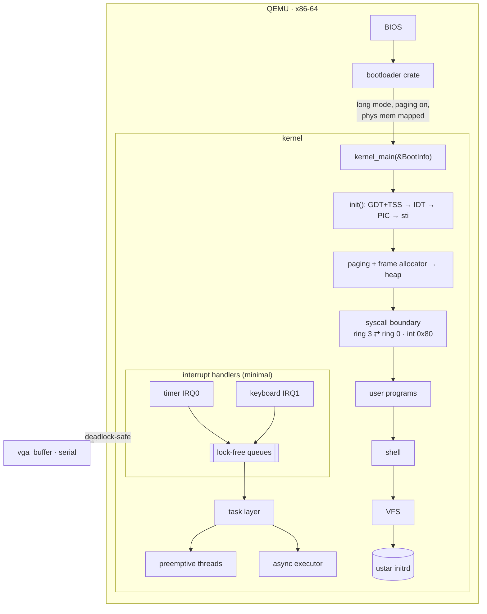
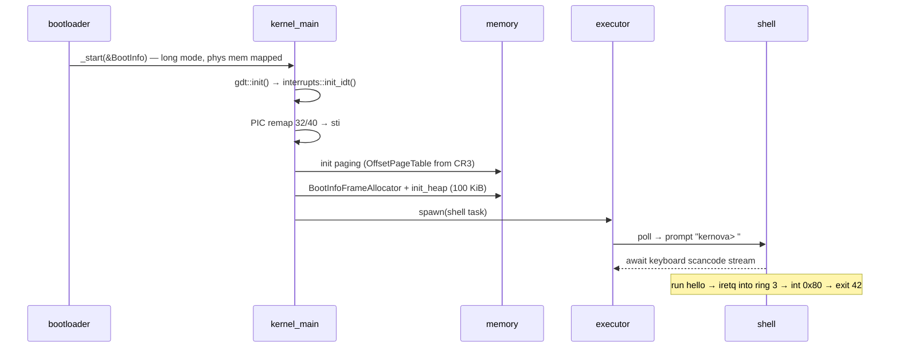
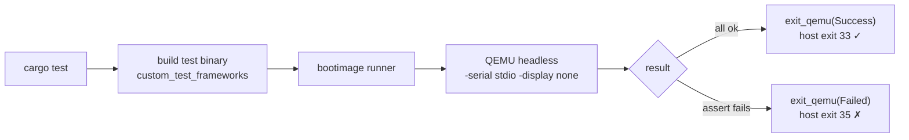
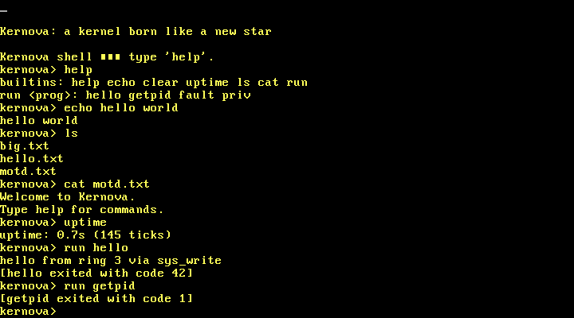
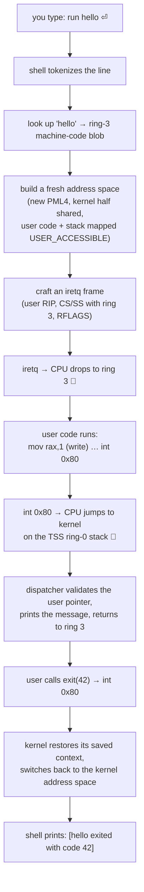
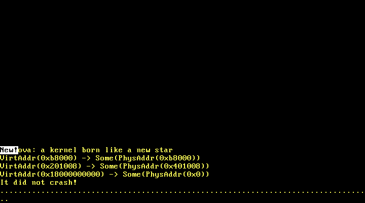
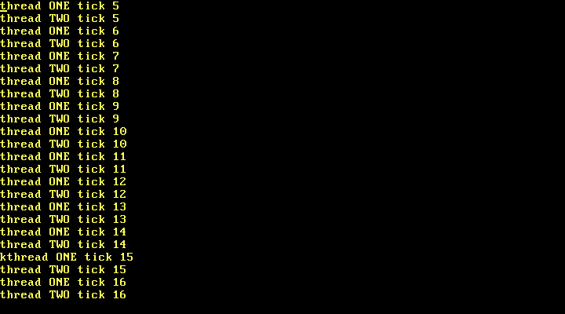

<div align="center">


### a kernel born like a new star

An x86-64 operating system kernel written from scratch in **Rust** (`no_std`), booted by the `bootloader` crate and run entirely inside **QEMU** — built milestone by milestone, every step verified on real emulated hardware.

<br/>


</div>

---

## What is Kernova?

Kernova (**kern**el + super**nova**) is a hobby OS kernel that goes from a bare freestanding
binary all the way to an interactive shell running ring-3 user programs — in **14 milestones**,
each a single tagged commit that must **boot and pass tests before the next begins**.

It is a learning kernel: QEMU only, single core, x86-64 long mode, no real-hardware code paths.
Primary references are *Writing an OS in Rust* (os.phil-opp.com), the OSDev Wiki, and OSTEP.

<details>
<summary><strong>🔰 New to kernels? Read this 60-second primer first</strong></summary>

<br/>

A **kernel** is the lowest layer of software — it runs directly on the CPU with nothing
underneath it. No operating system to call, no libraries, no `println`. If you want to put a
character on the screen, *you* write to video memory. If a key is pressed, *you* handle the
hardware interrupt. Kernova builds every one of those pieces by hand, in order:

- **Freestanding binary** — Rust with no standard library (`no_std`). You get `core` and
  nothing else; even `main` doesn't exist until you make it.
- **Interrupts** — the CPU stops your code to say "a key was pressed" / "the timer ticked".
  You register handlers in a table (the IDT) so the CPU knows where to jump.
- **Paging** — the MMU translates *virtual* addresses your code uses into *physical* RAM
  addresses. You control the page tables, so you decide what memory exists and who can touch it.
- **Heap** — once paging works you can hand out memory, so `Box`/`Vec`/`String` finally work.
- **Multitasking** — running more than one thing: cooperatively (tasks that yield) and
  preemptively (the timer forcibly switches between threads).
- **User mode (ring 3)** — untrusted programs run with reduced privilege. They can't touch
  kernel memory or hardware directly; they ask the kernel via **syscalls**. If they misbehave,
  the kernel kills *them*, not itself.
- **Filesystem + shell** — read files from an embedded archive, and type commands to run it all.

Every milestone below adds exactly one of these layers and proves it boots in QEMU before moving on.

</details>

```text
BIOS ─▶ bootloader crate ─▶ long mode + paging ─▶ kernel_main
                                                      │
        VGA + serial ─ IDT ─ GDT/TSS ─ PIC/IRQs ─ paging ─ heap
                                                      │
        async executor ─ preemptive threads ─ ring-3 user mode + syscalls
                                                      │
                          ustar initrd ─▶ interactive shell
```

---

## Feature tour

| Subsystem | What works | Milestone |
|---|---|---|
| **Boot** | freestanding `no_std` binary, `entry_point!`, boots QEMU | M1 |
| **Console** | VGA text `print!`/`println!`, COM1 serial, panic prints location | M2–M3 |
| **Testing** | headless `cargo test` in QEMU via `isa-debug-exit`, should-panic + stack-overflow tests | M3, M5 |
| **Exceptions** | IDT, breakpoint (resume), page-fault report (CR2), double-fault on IST stack | M4–M5 |
| **Interrupts** | PIC remap 32/40, timer ticks, live keyboard echo, deadlock-safe prints | M6 |
| **Memory** | 4-level paging via `OffsetPageTable`, frame allocator, 100 KiB heap (`Box`/`Vec`/`String`/`Rc`), clean OOM | M7–M8 |
| **Multitasking** | cooperative async executor with real wakers **+** preemptive round-robin threads (asm context switch) | M9–M10 |
| **User mode** | ring 3 via `iretq`, `int 0x80` syscalls (`read`/`write`/`exit`/`getpid`), per-process PML4, fault isolation | M11 |
| **Filesystem** | read-only ustar initrd packed at build time, VFS `read`/`list` | M12 |
| **Shell** | async task, backspace line editing, builtins + `run <prog>` | M13 |

<details>
<summary><strong>📖 Concept glossary</strong> — click for plain-language definitions</summary>

<br/>

| Term | In plain words |
|---|---|
| `no_std` | Rust without the standard library — no OS to lean on. You only get `core`. |
| **bootloader** | Code that runs first, sets up the CPU (long mode, paging), and jumps to your kernel. |
| **IDT** | Interrupt Descriptor Table — a lookup table: "for interrupt N, run this function." |
| **GDT / TSS** | Segment + task tables the CPU requires; here they mainly hold the special crash-safe stack and user-mode segments. |
| **IRQ** | A hardware interrupt (timer = IRQ0, keyboard = IRQ1). |
| **PIC** | The chip that routes IRQs to the CPU; we remap it so its numbers don't collide with CPU exceptions. |
| **Paging / MMU** | Hardware that maps virtual addresses → physical RAM in 4 KiB pages. |
| **frame** | One 4 KiB chunk of physical RAM. |
| **page fault** | The CPU trap when code touches an unmapped/forbidden address. |
| **double fault** | A fault *while handling a fault* — must be caught or the machine resets (triple fault). |
| **ring 3** | Least-privileged CPU mode; where user programs run. Ring 0 = kernel. |
| **syscall** | The controlled doorway a ring-3 program uses to ask the kernel for something. |
| **initrd** | A small filesystem image baked into the kernel at build time. |
| **ustar** | The classic `tar` archive format — our initrd's on-disk layout. |
| **QEMU** | The emulator we run the whole kernel inside — no real hardware, ever. |

</details>

---

## Architecture



## Boot & init sequence



## Milestone roadmap — all shipped


---

## Quickstart

**Prerequisites** (macOS shown — see `docs/DEVELOPMENT.md` for Linux/WSL2):

```bash
brew install qemu
rustup toolchain install nightly --component rust-src --component llvm-tools-preview
cargo install bootimage
```

**Build · run · test:**

```bash
cargo build          # compile the kernel
cargo run            # build bootimage + launch QEMU
cargo test           # unit + integration tests, headless in QEMU
```

### How `cargo test` works



Every test reports `[ok]` over serial and maps its result to a host exit code — 17 tests across
6 QEMU binaries plus the ustar unit tests, all green.

---

## The shell (M13)

```text
kernova> help
builtins: help echo clear uptime ls cat run
run <prog>: hello getpid fault priv
kernova> ls
big.txt
hello.txt
motd.txt
kernova> cat motd.txt
Welcome to Kernova.
Type help for commands.
kernova> run hello
hello from ring 3 via sys_write
[hello exited with code 42]
kernova> run getpid
[getpid exited with code 1]
kernova> run fault
user program killed: page fault at VirtAddr(0x100000000000)
[fault exited with code 139]
```

<div align="center">

<br/><em>Live shell in QEMU: builtins + ring-3 programs, kernel survives faults.</em>
</div>

### Syscall ABI (`int 0x80`)

Number in `rax`, args in `rdi`/`rsi`/`rdx`, return in `rax`.

| # | Call | Notes |
|---|---|---|
| 0 | `read(fd, buf, len)` | v1.0: EOF |
| 1 | `write(fd, buf, len)` | fd 1 = console; user pointer range-checked |
| 2 | `exit(code)` | returns to kernel with code |
| 3 | `getpid()` | one process at a time → `1` |

A user program that dereferences garbage or runs a privileged instruction is **killed** (exit
139); the kernel logs it and keeps running.

### Under the hood: what happens when you type `run hello`



This one command exercises **almost every subsystem**: the shell (M13), the initrd/blob lookup,
paging (M7) to build the address space, the GDT/TSS (M5/M11) for the privilege switch, the IDT
(M4) for `int 0x80`, and pointer validation (M11). If the program faulted instead, the exception
handlers (M4) would catch it and kill just the program.

---

## More from the build

<div align="center">


<br/>
<em>Left: M7 virtual→physical translation + a new mapping writing "New!" to VGA.
Right: M10 two CPU-bound threads (no yields) preempted by the timer.</em>
</div>

---

## Memory map

| Region | Where | Notes |
|---|---|---|
| Kernel image | bootloader-linked | code + statics |
| All physical memory | `physical_memory_offset` | page-table walking = pointer math |
| Kernel heap | `0x_4444_4444_0000`, 100 KiB | `linked_list_allocator` as `#[global_allocator]` |
| Double-fault IST stack | 20 KiB static | survives a kernel stack overflow |
| User space | PML4 slot 32 (`0x1000_0000_0000`) | fresh PML4 per `run`, kernel half shared |

---

## Repo layout

```text
src/
  main.rs          entry_point!, kernel_main, panic handlers
  lib.rs           init(), test framework, re-exports
  vga_buffer.rs    serial.rs          console output
  gdt.rs           interrupts.rs      GDT/TSS, IDT + handlers
  memory.rs        allocator.rs       paging, frame alloc, heap
  task/            async executor + keyboard task        (M9)
  sched/           threads, context-switch asm, RR queue (M10)
  usermode/        ring 3 entry, int 0x80 syscalls, blobs (M11)
  fs/              ustar parser + VFS                    (M12)
  shell.rs         interactive shell                     (M13)
tests/             one QEMU-run binary each
initrd/            files packed into the ustar initrd
build.rs           packs initrd/ → ustar at build time
docs/              PRD, TRD, ARCHITECTURE, MILESTONES, DECISIONS (ADRs), …
```

## Reading the code — a suggested order

New to the codebase? Follow the milestone order — each file adds one concept on top of the last:

1. **`src/main.rs`** — `kernel_main`: the whole boot story in ~40 lines. Start here.
2. **`src/vga_buffer.rs`** / **`src/serial.rs`** — how output works before anything else does.
3. **`src/interrupts.rs`** — the IDT and every handler (exceptions + timer + keyboard + `int 0x80`).
4. **`src/gdt.rs`** — the crash-safe stack and the user-mode segments.
5. **`src/memory.rs`** / **`src/allocator.rs`** — paging, frames, and the heap.
6. **`src/task/`** — the async executor and the keyboard-to-task pipeline.
7. **`src/usermode/`** — dropping to ring 3, the syscall dispatcher, and fault isolation.
8. **`src/fs/`** + **`src/shell.rs`** — the initrd parser and the shell that ties it together.

Every architectural decision has a one-paragraph rationale in **`docs/DECISIONS.md`** (ADRs), and
the exact acceptance criteria per milestone live in **`docs/MILESTONES.md`**.

## How this was built — the rules

- **One milestone at a time.** Implement only the active milestone; don't start the next until
  its acceptance criteria pass. Each milestone is one commit + tag (`m0`…`m12`, `v1.0`).
- **Every change must boot.** After any change, `cargo run` reaches the kernel and `cargo test`
  passes in QEMU. A commit that triple-faults is worse than no commit.
- **Never guess — verify.** Crate APIs pinned per milestone; hardware constants only from
  `docs/REFERENCES.md` or a freshly fetched OSDev/Intel SDM page.
- **Every `unsafe` / `asm!` carries a `// SAFETY:` comment.**
- **Claims require evidence.** Every milestone was proven with a real QEMU screendump or serial
  `[ok]` output — never "it boots" without showing it.

---

## Roadmap (post-v1.0 · M14 stretch)

ATA PIO → AHCI disk reads · FAT32 read-only mount · proper ELF loader (makes `run` initrd-backed)
· e1000 NIC + minimal ARP/ICMP. Each gets its own acceptance criteria + ADR before starting.

**Accepted debt** (documented in `docs/DECISIONS.md`): O(n²) frame allocator that never frees ·
user frames/PML4 leaked per `run` · no stack guard pages · single user process with preemption
paused in ring 3.

## References

- [Writing an OS in Rust](https://os.phil-opp.com) — primary guide
- [OSDev Wiki](https://wiki.osdev.org) · [OSTEP](https://pages.cs.wisc.edu/~remzi/OSTEP/) · [xv6 / MIT 6.1810](https://pdos.csail.mit.edu/6.1810/)
- Intel SDM Vol. 3 (system programming)

<div align="center">
<br/>
<strong>Kernova</strong> · x86-64 · Rust <code>no_std</code> · QEMU · built one verified milestone at a time
</div>
